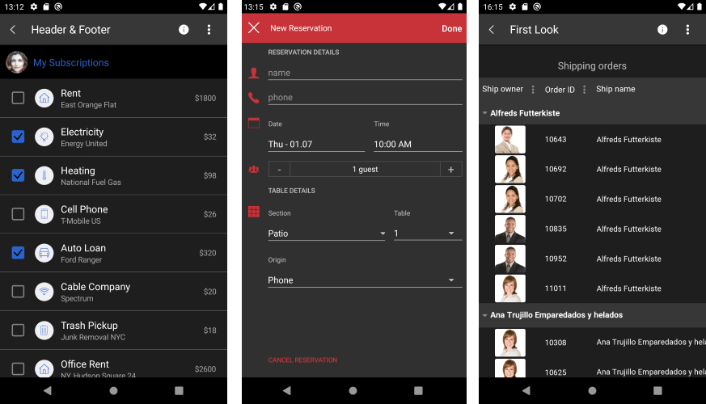
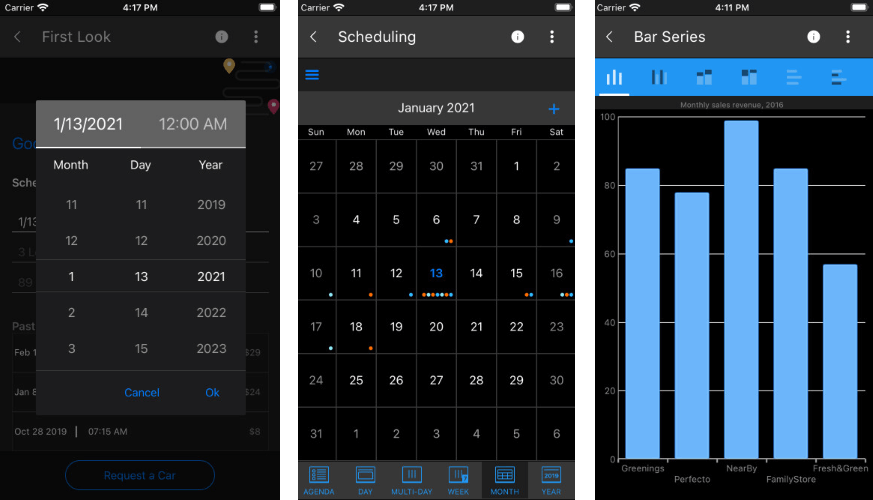

# Overview

Android 10 (API level 29) and iOS 13 introduce system-wide dark appearance for all user interface elements, known as [Dark theme](https://developer.android.com/guide/topics/ui/look-and-feel/darktheme) for Android and [Dark Mode](https://developer.apple.com/documentation/xcode/supporting_dark_mode_in_your_interface) for iOS. They have many benefits as to allow users to toggle their interface and focus on the application’s content based on ambient lighting conditions as well as to reduce power usage amount depending on the device's screen technology.

Telerik UI for Xamariin controls have a support for Dark Theme/Dark Mode from the R1 2021 Official Release.

## Dark Theme for Android

By default, existing Xamarin.Forms applications won't be affected by the Dark theme for Android. With no changes, they will look the same way as on Light theme.

In order to support Dark theme for Android, the application's theme must inherit from a DayNight theme as explained [here](https://developer.android.com/guide/topics/ui/look-and-feel/darktheme#supporting_dark_theme_in_your_app).

For more details about System theme changes please review the official Microsoft documentation about [Respond to system theme changes in Xamarin.Forms applications](https://docs.microsoft.com/en-us/xamarin/xamarin-forms/user-interface/theming/system-theme-changes).  

Here is how the Telerik Xamarin Samples Application looks with Darh theme:



> Make sure to test your application carefully and thoroughly on both Light and Dark system appearance.

## Dark Mode for iOS

Telerik UI for Xamarin controls automatically react to system appearance changes.

Here is how the Telerik Xamarin Samples Application looks with Darh Mode:



> Make sure to test your application carefully and thoroughly on both Light and Dark system appearance.

## Dark Theme for UWP

If you want to use Dark Theme in our UWP application you will need to change the `RequestedTheme` property in the `App.xaml` file of the UWP project.

Example:

```XAML
<Application
    x:Class="QSF.UWP.App"
    xmlns="http://schemas.microsoft.com/winfx/2006/xaml/presentation"
    xmlns:x="http://schemas.microsoft.com/winfx/2006/xaml"
    xmlns:local="using:QSF.UWP"
    RequestedTheme="Dark">
</Application>
```


> Make sure to test your application carefully and thoroughly on both Light and Dark system appearance.

## See Also


