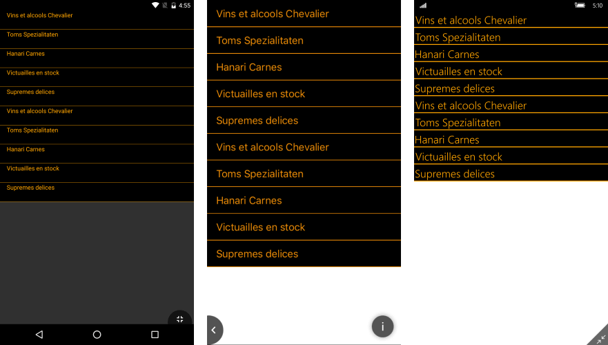

# How to Create a Custom Theme Based on a Telerik Theme

This article provides more information on the default resources structure and how to modify them and create a custom theme which is based on the Telerik Theme.

## Blue Theme Default Resources

The default resources are located in the **Telerik.XamarinForms.Common** assembly and you need to merge them in your application's resources in order to apply the theme. Below is the definition of the resources and respectively the default colors that are used for the different controls:

```xml
<ResourceDictionary xmlns="http://xamarin.com/schemas/2014/forms"
    xmlns:x="http://schemas.microsoft.com/winfx/2009/xaml"
    x:Class="Telerik.XamarinForms.Common.BlueResources">
    <!-- AutoComplete -->
    <Color x:Key="TelerikAutoCompleteSelectedTokenBackgroundColor">#3148CA</Color>
    <Color x:Key="TelerikAutoCompleteSelectedTokenStrokeColor">#3148CA</Color>
    <Color x:Key="TelerikAutoCompleteSelectedTokenTextColor">#FFFFFF</Color>
    <Color x:Key="TelerikAutoCompleteSuggestionItemTextColor">#3148CA</Color>
    <Color x:Key="TelerikAutoCompleteBorderColor">#D9D9D9</Color>
    <Color x:Key="TelerikAutoCompleteSuggestionViewBackgroundColor">#F8F8F8</Color>
    <Color x:Key="TelerikAutoCompleteTokenTextColor">#3148CA</Color>
    <Color x:Key="TelerikAutoCompleteTokenStrokeColor">#3148CA</Color>
    <Color x:Key="TelerikAutoCompleteTokenBackgroundColor">#F8F8F8</Color>

    <!-- BusyIndicator -->
    <Color x:Key="TelerikBusyIndicatorContent">#3148CA</Color>

    <!-- Button -->
    <Color x:Key="TelerikButtonBackgroundColor">#3148CA</Color>
    <Color x:Key="TelerikButtonTextColor">White</Color>

    <!-- Calendar -->
    <Color x:Key="TelerikCalendarBasicFontColor">#4A4949</Color>
    <Color x:Key="TelerikCalendarAlternativeFontColor">#919191</Color>
    <Color x:Key="TelerikCalendarMenuBarColor">#F8F8F8</Color>
    <Color x:Key="TelerikCalendarAccentColor1">#3148CA</Color>
    <Color x:Key="TelerikCalendarAccentColor2">#30BCFF</Color>
    <Color x:Key="TelerikCalendarBackgroundColor1">#3D5AFE</Color>
    <Color x:Key="TelerikCalendarBackgroundColor2">#000000</Color>
    <Color x:Key="TelerikCalendarBackgroundColor3">#FFFFFF</Color>

    <!-- Chart -->
    <Color x:Key="TelerikChartAxisColor">#919191</Color>
    <Color x:Key="TelerikChartGridLinesColor">#D9D9D9</Color>

    <!-- Chat -->
    <Color x:Key="TelerikChatIncomingMessageTextColor">#333333</Color>
    <Color x:Key="TelerikChatOutgoingMessageTextColor">#FFFFFF</Color>
    <Color x:Key="TelerikChatIncomingMessageBackgroundColor">#FFFFFF</Color>
    <Color x:Key="TelerikChatOutgoingMessageBackgroundColor">#3148CA</Color>
    <Color x:Key="TelerikChatCardTitleTextColor">#3148CA</Color>
    <Color x:Key="TelerikChatCardActionTextColor">#3148CA</Color>
    <Color x:Key="TelerikChatTypingIndicatorDotsColor">#3148CA</Color>
    <Color x:Key="TelerikChatPickerHeaderBackgroundColor">#F8F8F8</Color>
    <Color x:Key="TelerikChatPickerHeaderTextColor">#3148CA</Color>
    <Color x:Key="TelerikChatPickerOkButtonTextColor">#3148CA</Color>
    <Color x:Key="TelerikChatPickerCancelButtonTextColor">#3148CA</Color>
    <Color x:Key="TelerikChatPickerFooterBackgroundColor">#F8F8F8</Color>
    <Color x:Key="TelerikChatItemPickerSelectedBackgroundColor">Transparent</Color>
    <Color x:Key="TelerikChatItemPickerSelectedBorderColor">#3148CA</Color>
    <Color x:Key="TelerikChatItemPickerSelectedTextColor">#3148CA</Color>

    <!-- CheckBox -->
    <Color x:Key="TelerikCheckBoxCheckedColor">#3148CA</Color>
    <Color x:Key="TelerikCheckBoxCheckedSymbolColor">White</Color>
    <Color x:Key="TelerikCheckBoxIndeterminateColor">#3148CA</Color>
    <Color x:Key="TelerikCheckBoxIndeterminateSymbolColor">White</Color>
    <Color x:Key="TelerikCheckBoxUncheckedColor">#919191</Color>

    <!-- DataForm -->
    <Color x:Key="TelerikDataFormEditorAccentColor">#3148CA</Color>
    <Color x:Key="TelerikDataFormBackgroundColor">White</Color>
    <Color x:Key="TelerikDataFormHeaderFontColor">#919191</Color>
    <Color x:Key="TelerikDataFormEditorBorderColor">#D9D9D9</Color>

    <!-- DataGrid -->
    <Color x:Key="TelerikDataGridAccentColor">#3148CA</Color>

    <!-- Entry -->
    <OnPlatform x:TypeArguments="Color"
                x:Key="TelerikEntryTextColor">
        <On Platform="iOS"
            Value="#020202" />
    </OnPlatform>
    <Color x:Key="TelerikEntryBorderColor">#3148CA</Color>

    <!-- Expander -->
    <Color x:Key="TelerikExpandCollapseIndicatorColor">#3148CA</Color>

    <!-- ListView -->
    <Color x:Key="TelerikListViewItemBorderColor">#D9D9D9</Color>
    <Color x:Key="TelerikListViewSelectionColor">#3148CA</Color>
    <Color x:Key="TelerikListViewBackgroundColor">White</Color>
    <Color x:Key="TelerikListViewForegroundColor">#4A4949</Color>
    <Color x:Key="TelerikListViewGroupHeaderBackgroundColor">#F8F8F8</Color>

    <!-- MaskedInput -->
    <Color x:Key="TelerikMaskedInputBorderColor">#3148CA</Color>
    <Color x:Key="TelerikMaskedInputWatermarkColor">#3148CA</Color>
    <Color x:Key="TelerikMaskedInputErrorColor">#D50002</Color>
    <Color x:Key="TelerikMaskedInputDisplayedTextColor">#4A4949</Color>

    <!-- NonVirtualizedItemsControl -->
    <Color x:Key="TelerikNonVirtualizedItemsControlSelectedBackgroundColor">Transparent</Color>
    <Color x:Key="TelerikNonVirtualizedItemsControlSelectedBorderColor">#3148CA</Color>
    <Color x:Key="TelerikNonVirtualizedItemsControlSelectedTextColor">#3148CA</Color>

    <!-- NumericInput -->
    <Color x:Key="TelerikNumericInputButtonBorderColor">#3148CA</Color>
    <Color x:Key="TelerikNumericInputButtonTextColor">#3148CA</Color>
    <Color x:Key="TelerikNumericInputButtonBackgroundColor">Transparent</Color>
    <Color x:Key="TelerikNumericInputEntryBorderColor">#3148CA</Color>
    <OnPlatform x:TypeArguments="Color"
                x:Key="TelerikNumericInputEntryTextColor">
        <On Platform="iOS"
            Value="#020202" />
    </OnPlatform>

    <!-- Rating -->
    <Color x:Key="TelerikRatingControlAccentColor">#3148CA</Color>

    <!-- SegmentedControl -->
    <Color x:Key="TelerikSegmentControlAccentColor">#3148CA</Color>
    <Color x:Key="TelerikSegmentControlMainColor">#FFFFFF</Color>
    <Color x:Key="TelerikSegmentControlDisabledTextColor">#803148CA</Color>

    <!-- SlideView -->
    <Color x:Key="TelerikSlideViewIndicatorColor">#D9D9D9</Color>
    <Color x:Key="TelerikSlideViewSelectedIndicatorColor">#3148CA</Color>
    <Color x:Key="TelerikSlideViewSlideButtonsColor">#3148CA</Color>

    <!-- TabView-->
    <Color x:Key="TelerikTabViewHeaderItemSelectedColor">#3148CA</Color>

    <!-- TimePicker -->
    <Color x:Key="TelerikTimePickerSelectedBackgroundColor">Transparent</Color>
    <Color x:Key="TelerikTimePickerSelectedBorderColor">#3148CA</Color>
    <Color x:Key="TelerikTimePickerSelectedTextColor">#3148CA</Color>

    <!-- TreeView -->
    <Color x:Key="TelerikTreeViewCheckBoxCheckedColor">#3148CA</Color>
    <Color x:Key="TelerikTreeViewCheckBoxCheckedSymbolColor">White</Color>
    <Color x:Key="TelerikTreeViewCheckBoxIndeterminateColor">#3148CA</Color>
    <Color x:Key="TelerikTreeViewCheckBoxIndeterminateSymbolColor">White</Color>
    <Color x:Key="TelerikTreeViewCheckBoxUncheckedColor">#919191</Color>
    <Color x:Key="TelerikTreeViewItemTextTextColor">Black</Color>
    <Color x:Key="TelerikTreeViewExpandCollapseIndicatorTextColor">#3148CA</Color>
</ResourceDictionary>
```

## Customizing the Colors

You can replace the values of the colors with custom ones. This way you can modify the overall appearance which is applied for the different instances of the controls. In order to do so, you can directly modify some of the default resources. The following example shows how to change the appearance of all **RadListView** instances that use the theme:

```XAML
<Application xmlns="http://xamarin.com/schemas/2014/forms"
             xmlns:x="http://schemas.microsoft.com/winfx/2009/xaml"
             xmlns:telerikPrimitives="clr-namespace:Telerik.XamarinForms.Primitives;assembly=Telerik.XamarinForms.Primitives"
             xmlns:telerikDataGrid="clr-namespace:Telerik.XamarinForms.DataGrid;assembly=Telerik.XamarinForms.DataGrid"
             xmlns:telerikChart="clr-namespace:Telerik.XamarinForms.Chart;assembly=Telerik.XamarinForms.Chart"
             xmlns:telerikInput="clr-namespace:Telerik.XamarinForms.Input;assembly=Telerik.XamarinForms.Input"
             xmlns:telerikDataControls="clr-namespace:Telerik.XamarinForms.DataControls;assembly=Telerik.XamarinForms.DataControls"
             xmlns:telerikConversationalUi="clr-namespace:Telerik.XamarinForms.ConversationalUI;assembly=Telerik.XamarinForms.ConversationalUI"
             xmlns:portable="clr-namespace:DuaneThemeDemo.Portable;assembly=MyApplication.Portable"
             xmlns:telerikCommon="clr-namespace:Telerik.XamarinForms.Common;assembly=Telerik.XamarinForms.Common"
             x:Class="MyApplication.Portable.App">
	
    <Application.Resources>
        <ResourceDictionary>
            <ResourceDictionary.MergedDictionaries>
                <ResourceDictionary MergedWith="telerikCommon:BlueResources">
                    <ResourceDictionary.MergedDictionaries>
                        <ResourceDictionary>
                            <!-- Override default colors here. -->
                            <Color x:Key="TelerikCalendarBasicFontColor">Orange</Color>
                            <Color x:Key="TelerikBusyIndicatorContent">Yellow</Color>
                        </ResourceDictionary>
                    </ResourceDictionary.MergedDictionaries>
                </ResourceDictionary>
                <!-- Telerik themes go here. -->
                <ResourceDictionary MergedWith="input:TelerikThemeStyles" />
                <ResourceDictionary MergedWith="primitives:TelerikThemeStyles" />
                <ResourceDictionary MergedWith="chart:TelerikThemeStyles" />
                <ResourceDictionary MergedWith="dataControls:TelerikThemeStyles" />
                <ResourceDictionary MergedWith="dataGrid:TelerikThemeStyles" />
                <ResourceDictionary MergedWith="conversationalUi:TelerikThemeStyles" />
            </ResourceDictionary.MergedDictionaries>
        </ResourceDictionary>
    </Application.Resources>
</Application>
```

## Separate ResourceDictionary file

Another possibility is to create your own **ResourceDictionary** and merge it instead of the default **telerikCommon:BlueResources** one.

1. Add a new XAML ContentPage file to your application and *delete* all the boilerplate **ContentPage.Content** code
2. Change the `ContentPage` type to `ResourceDictionary` type

```xml
<!-- Change -->
<ContentPage ...>
</ContentPage>

<!-- to ResourceDictionary -->
<ResourceDictionary ...>
</ResourceDictionary>
```
3. Change the base type in the code behind from `ContentPage` to `ResourceDictionary`:

```csharp
// Set base type to ResourceDictionary
public partial class MyTheme : ResourceDictionary
{
    public MyTheme()
    {
        InitializeComponent();
    }
}
```

4. Add the Telerik Blue theme resources

```xml
<ResourceDictionary xmlns="http://xamarin.com/schemas/2014/forms"
    xmlns:x="http://schemas.microsoft.com/winfx/2009/xaml"
    x:Class="MyApplication.MyTheme">
<!-- AutoComplete -->
    <Color x:Key="TelerikAutoCompleteSelectedTokenBackgroundColor">#3148CA</Color>
    <Color x:Key="TelerikAutoCompleteSelectedTokenStrokeColor">#3148CA</Color>
    <Color x:Key="TelerikAutoCompleteSelectedTokenTextColor">#FFFFFF</Color>
    <Color x:Key="TelerikAutoCompleteSuggestionItemTextColor">#3148CA</Color>
    <Color x:Key="TelerikAutoCompleteBorderColor">#D9D9D9</Color>
    <Color x:Key="TelerikAutoCompleteSuggestionViewBackgroundColor">#F8F8F8</Color>
    <Color x:Key="TelerikAutoCompleteTokenTextColor">#3148CA</Color>
    <Color x:Key="TelerikAutoCompleteTokenStrokeColor">#3148CA</Color>
    <Color x:Key="TelerikAutoCompleteTokenBackgroundColor">#F8F8F8</Color>

    <!-- BusyIndicator -->
    <Color x:Key="TelerikBusyIndicatorContent">#3148CA</Color>

    <!-- Button -->
    <Color x:Key="TelerikButtonBackgroundColor">#3148CA</Color>
    <Color x:Key="TelerikButtonTextColor">White</Color>

    <!-- Calendar -->
    <Color x:Key="TelerikCalendarBasicFontColor">#4A4949</Color>
    <Color x:Key="TelerikCalendarAlternativeFontColor">#919191</Color>
    <Color x:Key="TelerikCalendarMenuBarColor">#F8F8F8</Color>
    <Color x:Key="TelerikCalendarAccentColor1">#3148CA</Color>
    <Color x:Key="TelerikCalendarAccentColor2">#30BCFF</Color>
    <Color x:Key="TelerikCalendarBackgroundColor1">#3D5AFE</Color>
    <Color x:Key="TelerikCalendarBackgroundColor2">#000000</Color>
    <Color x:Key="TelerikCalendarBackgroundColor3">#FFFFFF</Color>

    <!-- Chart -->
    <Color x:Key="TelerikChartAxisColor">#919191</Color>
    <Color x:Key="TelerikChartGridLinesColor">#D9D9D9</Color>

    <!-- Chat -->
    <Color x:Key="TelerikChatIncomingMessageTextColor">#333333</Color>
    <Color x:Key="TelerikChatOutgoingMessageTextColor">#FFFFFF</Color>
    <Color x:Key="TelerikChatIncomingMessageBackgroundColor">#FFFFFF</Color>
    <Color x:Key="TelerikChatOutgoingMessageBackgroundColor">#3148CA</Color>
    <Color x:Key="TelerikChatCardTitleTextColor">#3148CA</Color>
    <Color x:Key="TelerikChatCardActionTextColor">#3148CA</Color>
    <Color x:Key="TelerikChatTypingIndicatorDotsColor">#3148CA</Color>
    <Color x:Key="TelerikChatPickerHeaderBackgroundColor">#F8F8F8</Color>
    <Color x:Key="TelerikChatPickerHeaderTextColor">#3148CA</Color>
    <Color x:Key="TelerikChatPickerOkButtonTextColor">#3148CA</Color>
    <Color x:Key="TelerikChatPickerCancelButtonTextColor">#3148CA</Color>
    <Color x:Key="TelerikChatPickerFooterBackgroundColor">#F8F8F8</Color>
    <Color x:Key="TelerikChatItemPickerSelectedBackgroundColor">Transparent</Color>
    <Color x:Key="TelerikChatItemPickerSelectedBorderColor">#3148CA</Color>
    <Color x:Key="TelerikChatItemPickerSelectedTextColor">#3148CA</Color>

    <!-- CheckBox -->
    <Color x:Key="TelerikCheckBoxCheckedColor">#3148CA</Color>
    <Color x:Key="TelerikCheckBoxCheckedSymbolColor">White</Color>
    <Color x:Key="TelerikCheckBoxIndeterminateColor">#3148CA</Color>
    <Color x:Key="TelerikCheckBoxIndeterminateSymbolColor">White</Color>
    <Color x:Key="TelerikCheckBoxUncheckedColor">#919191</Color>

    <!-- DataForm -->
    <Color x:Key="TelerikDataFormEditorAccentColor">#3148CA</Color>
    <Color x:Key="TelerikDataFormBackgroundColor">White</Color>
    <Color x:Key="TelerikDataFormHeaderFontColor">#919191</Color>
    <Color x:Key="TelerikDataFormEditorBorderColor">#D9D9D9</Color>

    <!-- DataGrid -->
    <Color x:Key="TelerikDataGridAccentColor">#3148CA</Color>

    <!-- Entry -->
    <OnPlatform x:TypeArguments="Color"
                x:Key="TelerikEntryTextColor">
        <On Platform="iOS"
            Value="#020202" />
    </OnPlatform>
    <Color x:Key="TelerikEntryBorderColor">#3148CA</Color>

    <!-- Expander -->
    <Color x:Key="TelerikExpandCollapseIndicatorColor">#3148CA</Color>

    <!-- ListView -->
    <Color x:Key="TelerikListViewItemBorderColor">#D9D9D9</Color>
    <Color x:Key="TelerikListViewSelectionColor">#3148CA</Color>
    <Color x:Key="TelerikListViewBackgroundColor">White</Color>
    <Color x:Key="TelerikListViewForegroundColor">#4A4949</Color>
    <Color x:Key="TelerikListViewGroupHeaderBackgroundColor">#F8F8F8</Color>

    <!-- MaskedInput -->
    <Color x:Key="TelerikMaskedInputBorderColor">#3148CA</Color>
    <Color x:Key="TelerikMaskedInputWatermarkColor">#3148CA</Color>
    <Color x:Key="TelerikMaskedInputErrorColor">#D50002</Color>
    <Color x:Key="TelerikMaskedInputDisplayedTextColor">#4A4949</Color>

    <!-- NonVirtualizedItemsControl -->
    <Color x:Key="TelerikNonVirtualizedItemsControlSelectedBackgroundColor">Transparent</Color>
    <Color x:Key="TelerikNonVirtualizedItemsControlSelectedBorderColor">#3148CA</Color>
    <Color x:Key="TelerikNonVirtualizedItemsControlSelectedTextColor">#3148CA</Color>

    <!-- NumericInput -->
    <Color x:Key="TelerikNumericInputButtonBorderColor">#3148CA</Color>
    <Color x:Key="TelerikNumericInputButtonTextColor">#3148CA</Color>
    <Color x:Key="TelerikNumericInputButtonBackgroundColor">Transparent</Color>
    <Color x:Key="TelerikNumericInputEntryBorderColor">#3148CA</Color>
    <OnPlatform x:TypeArguments="Color"
                x:Key="TelerikNumericInputEntryTextColor">
        <On Platform="iOS"
            Value="#020202" />
    </OnPlatform>

    <!-- Rating -->
    <Color x:Key="TelerikRatingControlAccentColor">#3148CA</Color>

    <!-- SegmentedControl -->
    <Color x:Key="TelerikSegmentControlAccentColor">#3148CA</Color>
    <Color x:Key="TelerikSegmentControlMainColor">#FFFFFF</Color>
    <Color x:Key="TelerikSegmentControlDisabledTextColor">#803148CA</Color>

    <!-- SlideView -->
    <Color x:Key="TelerikSlideViewIndicatorColor">#D9D9D9</Color>
    <Color x:Key="TelerikSlideViewSelectedIndicatorColor">#3148CA</Color>
    <Color x:Key="TelerikSlideViewSlideButtonsColor">#3148CA</Color>

    <!-- TabView-->
    <Color x:Key="TelerikTabViewHeaderItemSelectedColor">#3148CA</Color>

    <!-- TimePicker -->
    <Color x:Key="TelerikTimePickerSelectedBackgroundColor">Transparent</Color>
    <Color x:Key="TelerikTimePickerSelectedBorderColor">#3148CA</Color>
    <Color x:Key="TelerikTimePickerSelectedTextColor">#3148CA</Color>

    <!-- TreeView -->
    <Color x:Key="TelerikTreeViewCheckBoxCheckedColor">#3148CA</Color>
    <Color x:Key="TelerikTreeViewCheckBoxCheckedSymbolColor">White</Color>
    <Color x:Key="TelerikTreeViewCheckBoxIndeterminateColor">#3148CA</Color>
    <Color x:Key="TelerikTreeViewCheckBoxIndeterminateSymbolColor">White</Color>
    <Color x:Key="TelerikTreeViewCheckBoxUncheckedColor">#919191</Color>
    <Color x:Key="TelerikTreeViewItemTextTextColor">Black</Color>
    <Color x:Key="TelerikTreeViewExpandCollapseIndicatorTextColor">#3148CA</Color>
</ResourceDictionary>
```

5. Customize those color values with the ones you prefer for your theme.
6. Open **App.xaml** and replace BlueResources with your newly created one.

See the comment in the following example. Notice that `portable:MyTheme` has replaced `telerikCommon:BlueResources` in the MergedDictionaries list.

```xml
<Application xmlns="http://xamarin.com/schemas/2014/forms"
             xmlns:x="http://schemas.microsoft.com/winfx/2009/xaml"
             xmlns:telerikPrimitives="clr-namespace:Telerik.XamarinForms.Primitives;assembly=Telerik.XamarinForms.Primitives"
             xmlns:telerikDataGrid="clr-namespace:Telerik.XamarinForms.DataGrid;assembly=Telerik.XamarinForms.DataGrid"
             xmlns:telerikChart="clr-namespace:Telerik.XamarinForms.Chart;assembly=Telerik.XamarinForms.Chart"
             xmlns:telerikInput="clr-namespace:Telerik.XamarinForms.Input;assembly=Telerik.XamarinForms.Input"
             xmlns:telerikDataControls="clr-namespace:Telerik.XamarinForms.DataControls;assembly=Telerik.XamarinForms.DataControls"
             xmlns:telerikConversationalUi="clr-namespace:Telerik.XamarinForms.ConversationalUI;assembly=Telerik.XamarinForms.ConversationalUI"
             xmlns:portable="clr-namespace:DuaneThemeDemo.Portable;assembly=MyApplication.Portable"
             x:Class="MyApplication.Portable.App">
	
	<Application.Resources>
        <ResourceDictionary>
            <ResourceDictionary.MergedDictionaries>
                <!-- Your custom ResourceDictionary, with all the custom styles and colors -->
                <ResourceDictionary MergedWith="portable:MyTheme"/>

                <!-- Telerik themes go here. -->
                <ResourceDictionary MergedWith="input:TelerikThemeStyles" />
                <ResourceDictionary MergedWith="primitives:TelerikThemeStyles" />
                <ResourceDictionary MergedWith="chart:TelerikThemeStyles" />
                <ResourceDictionary MergedWith="dataControls:TelerikThemeStyles" />
                <ResourceDictionary MergedWith="dataGrid:TelerikThemeStyles" />
                <ResourceDictionary MergedWith="conversationalUi:TelerikThemeStyles" />
            </ResourceDictionary.MergedDictionaries>
        </ResourceDictionary>
	</Application.Resources>
</Application>
```

>important In case you need to modify the default resources of the TelerikTheme for the **RadDataForm** control, please refer to the following article - [DataForm: Modifying TelerikTheme resources]()

**Figure 1** shows the appearance of the **RadListView** once the changes are applied:



## See Also

* [How To Set a Theme]()
* [Themes Overview]()
