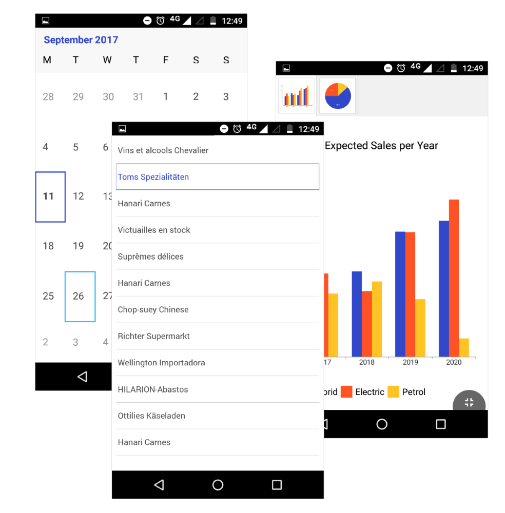

# What is a Telerik Theme

A **Telerik Theme** is a set of resources which are designed to provide your application with a consistent look and feel across all platforms. [Setting a theme]() for your application is an easy and straightforward process. Furthermore, you are free to [customize the theme's resources]() so that a more distinct appearance is achieved.

## Blue Theme

As its name suggests, the main accent of the **Blue Theme** is the blue color. Respectively, the additional brushes that are used are picked to nicely fit with the leading color. **Figure 1** shows how some of the controls look with the Theme set. The Default Theme Colors and their actual appearance are present in the table below.

#### Figure 1: Telerik Blue Theme

### Default Theme Colors

#### Main Colors
|Color| Hex Value| Appearance |
|----------|-----------|---|
|Basic Font Color|#4A4949|

|
|AlternativeFont Color|#919191|

|
|Accent Color 1|#3148CA|

|
|Background Color 1|#3D5AFE|

|
|Accent Color 2|#30BCFF|

|
|Background Color 2|#000000|

|
|Color of Grid|#D9D9D9|

|
|Color of Menu Bar|#F8F8F8|

#### Complementary Colors 

|Complementary Color| Hex Value| Appearance |
|----------|-----------|---|
|Complementary Color 1|#FF5225|

|
|Complementary Color 2|#FFC325|

|
|Complementary Color 3|#2EC262|

|
|Complementary Color 4|#FE3D5A|

|
|Complementary Color 5|#803DFE|

|
|Complementary Color 6|#3DBAFE|

## See Also

* [How To Set a Theme]()
* [How To Create a Custom Theme Based on a Telerik Theme]()

