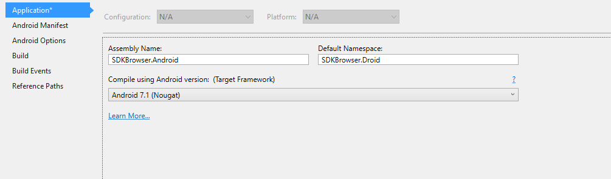
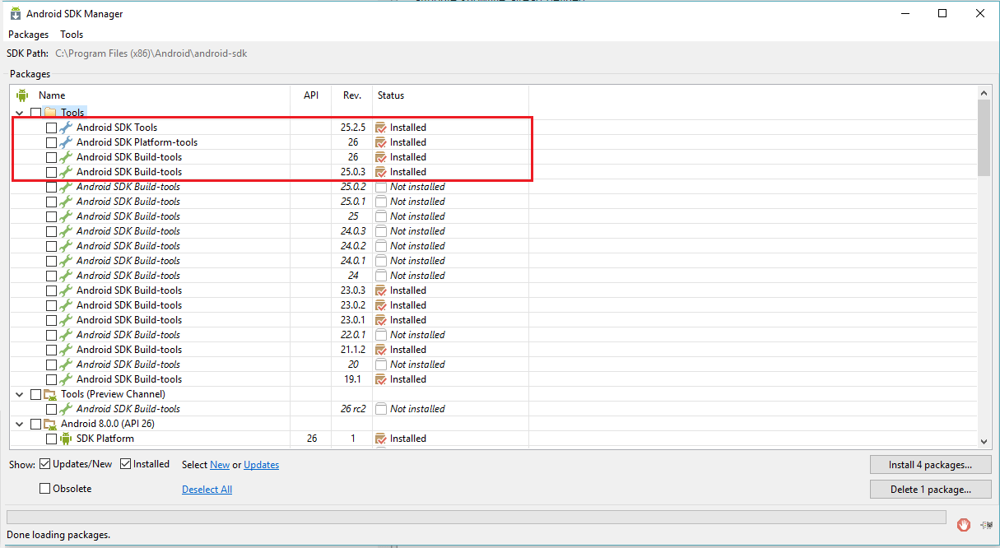

# Android: Error "Attribute "showTitle" Has Already Been Defined" #

If you come across this error which prevents your Android solution from building properly, it is most probably caused by discrepancy between the targeted **Android API** and the installed **Android SDK tools/Android SDK build tools**.

Usually such error appears when the app targets the latest version of Android, but the latest version of the tools is not installed. **Figure 1** shows how your **Android SDK Manager** should be set up to be able to target the latest version of Android   (the example refers to **Android 7.1 Nougat**):

#### **Figure 1: Android Application settings:**

#### **Figure 2: Android SDK Manager installed tools**

## See Also

- [Required Android Support Libraries]()
- [System Requirements]()
