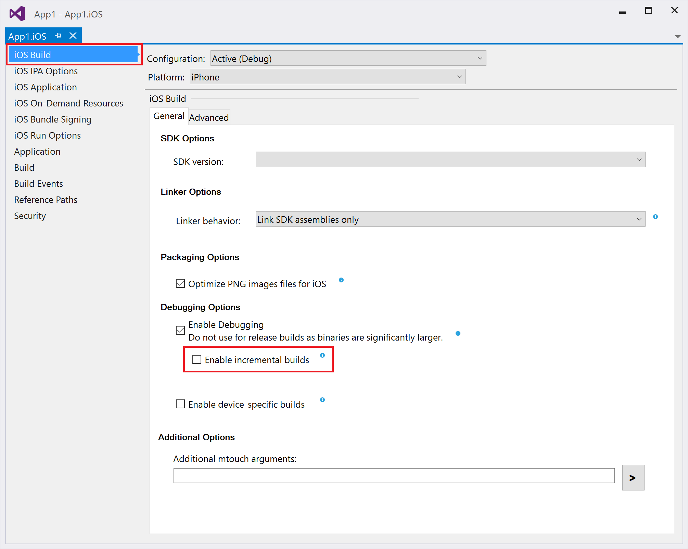
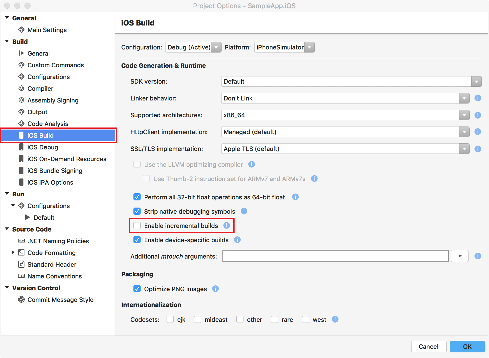

# iOS app has issues on device but runs fine on simulator

There are several reported issues with iOS applications that run fine on simulator but behave weird on device. Sometimes the app crashes or throws an exception, in other occasions some element styles looks weird or some components are not responsive.

Usually the problems are fixed when you uncheck the `Enable incremental builds` option from the iOS project settings.

On Visual Studio:

On Xamarin Studio:

## More Resources
* [iOS Build Mechanics](https://docs.microsoft.com/en-us/xamarin/ios/deploy-test/ios-build-mechanics?tabs=vswin) - Learn more about the differences between Simulator and Device build & deployment lifecycle (e.g. JIT vs AOT compilation), along with helpful tips and tricks, in the  documentation article.
* [Linker Behavior](https://docs.microsoft.com/en-us/xamarin/ios/deploy-test/linker?tabs=vswin) - Learn more about the mtouch linker. The  linker is used to remove features (code) from referenced libraries that the application is not using. Your project's selected linker behavior can have significant effect on the application. For example, if "SDK and User Assemblies" linker option is selected, any UI for Xamarin controls that do not have a reference will be stripped out during compilation. You can avoid this by enabling [XamlCompilation (aka XamlC)](https://docs.microsoft.com/en-us/xamarin/xamarin-forms/xaml/xamlc) or giving the control an x:Name.
