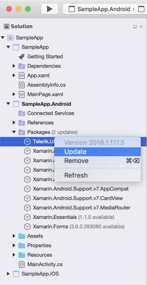

# Upgrading on Mac

The purpose of this topic is to explain you how to upgrade Telerik UI for Xamarin to a newer version on Mac. 

There are two options for referencing Telerik components and the upgrade method depends on which one you chose. Both are listed below:

* [Upgrade using the Telerik NuGet server](#upgrade-using-the-telerik-nuget-server)
* [Upgrade manually added assemblies](#upgrade-manually-added-assemblies)

## Upgrade using the Telerik NuGet server

>tip As a prerequisite, you would need to have Telerik NuGet packages server configured in Visual Studio for Mac as described in the following topic: [Telerik NuGet server](#visual-studio-for-mac). 

1.  With the solution open in Visual Studio for Mac, for example go to the Android project and expand __Packages__ folder.
2.  Find Telerik.UI.for.Xamarin package, right-click on it and select Update.

	
	
	This will update the Telerik UI for Xamarin package to the latest available version.
3.  Do the same for all other projects in the solution that have references to Telerik UI for Xamarin.

## Upgrade manually added assemblies

In order to upgrade your controls to a newer version of the suite, you need to perform the following instructions:

1. Download the installation method you prefer (pkg installation or zip file) from you Telerik account, check [Download Product Files]() for more details.
2. If the upgrade is major (i.e. from R3 2018 to R1 2019), check the [Release History](https://www.telerik.com/support/whats-new/xamarin-ui/release-history).
3. Back up your application.
4. Update all the Telerik references in all projects (.Net Standard/Shared, Android, iOS) in Visual Studio for Mac to point to the new assemblies.
5. Clean the solution.
6. Rebuild the projects.
7. Run the application.

## See Also

- [System Requirements]()
- [Telerik NuGet packages server]()
