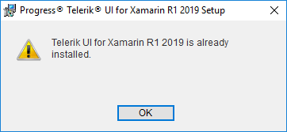
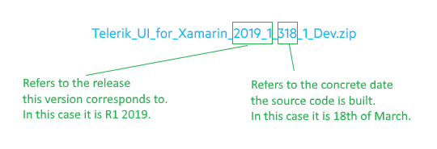

# Upgrading on Windows

The purpose of this topic is to explain you how to upgrade Telerik UI for Xamarin from Trial to Developer License or to a newer version on Windows. 

There are two options for referencing Telerik components and the upgrade method depends on which one you chose. Both are listed below:

* [Upgrade using the Telerik NuGet server](#upgrade-using-the-telerik-nuget-server)
* [Upgrade manually added assemblies](#upgrade-manually-added-assemblies)

## Upgrade using the Telerik NuGet server

>tip As a prerequisite, you would need to have Telerik NuGet packages server configured in Visual Studio as described in the following topic: [Telerik NuGet server](). 

1.	Go to Visual Studio and open the solution package manager.

	

2.	Select the Telerik server as a package source and enter their credentials when prompted.
3.	Go to Installed tab and find Telerik.UI.for.Xamarin package. 

	

4.	Select the package when found.
5.	Select which projects will have the package installed.
6.	Choose the desired version and click Install.

## Upgrade manually added assemblies

In order to upgrade your controls to a newer version of the suite, you need to perform the following instructions:

1. Download the installation method you prefer:

	* [MSI file for automatic installation]().
	* ZIP file for manual (advanced) installation - you can download the zip containing the dlls from the [Telerik UI for Xamarin product download page]().

2. If you have installed the trial version of Telerik UI for Xamarin and try to install the developer version of the same release, you will receive the following message: 

	

	So, you should remove the trial version first.

3. If the upgrade is major (i.e. from R3 2018 to R1 2019), check the [Release History](https://www.telerik.com/support/whats-new/xamarin-ui/release-history).
4. Back up your application.
5. Update all the Telerik references in all projects (.Net Standard/Shared, Android, iOS, UWP) in Visual Studio to point to the new assemblies.
6. Clean the solution.
7. Rebuild the projects.
8. Run the application.

## Check the version of Telerik UI for Xamarin

Each version number of Telerik UI for Xamarin is formed depending on what major release that version belongs to as well the source code build date. In other words, the version number corresponds to the date when the dlls were built.

The following image shows the name of the build generated on 18th of March (3rd month), after the R1 2019 release.

## See Also

- [System Requirements]()
- [Telerik NuGet packages server]()
